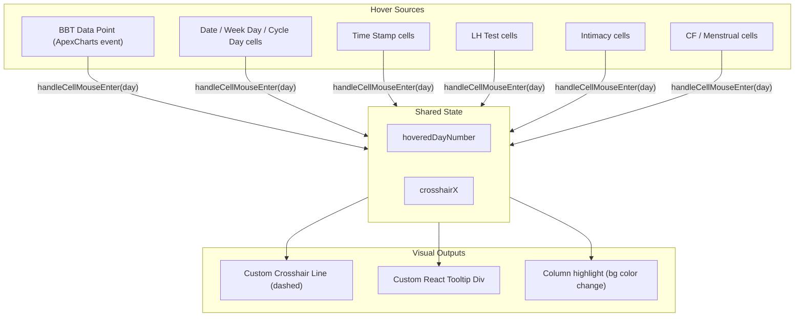

# Enhanced Crosshair & Tooltip for All Data Types

## Overview

Currently, the crosshair and tooltip only activate when hovering directly over BBT temperature data points on the chart line. This plan extends that functionality to work with ANY recorded data type and the top header rows.

## Key Issues Addressed

**1. Parent `pointer-events: none` blockers:** Four wrapper divs currently suppress all mouse events for their children. These must be removed at the wrapper level, with per-cell pointer-events toggling instead.

| Wrapper | Line | Class |

|---------|------|-------|

| Top rows (Date/WeekDay/CycleDay) | 719 | `pointer-events-none` |

| Time Stamp cells | 1023 | `pointer-events-none` |

| LH Test cells | 1086 | `pointer-events-none` |

| Intimacy cells | 1182 | `pointer-events-none` |

The CF/Menstrual wrapper (line 1257) does NOT have `pointer-events-none` so needs no change.

**2. Stale tooltip closure:** The ApexCharts `tooltip.custom` callback is captured inside a `useMemo` (line 523, deps: `[settings, chartData, allDaysWithBBT, cycle, navigate, yAxisRange, plotAreaWidth, plotAreaOffset]`). Even if we added `hoveredDayNumber` to the deps, the `custom` function only fires when hovering actual chart data points -- it will never fire for non-BBT cells. The solution: **disable the ApexCharts tooltip entirely and replace it with a standalone React-rendered tooltip div** that reads `hoveredDayNumber` from current component state on every render, completely avoiding the stale-closure problem.

## Changes to `[CycleChartPage.tsx](app/src/cycle-tracking/CycleChartPage.tsx)`

### 1. Create Data Detection Map

Add a new `useMemo` hook (after `opkStatusMap`, around line 298) to build a map of days with ANY recorded data:

```typescript
const daysWithDataMap = useMemo(() => {
  if (!cycle || !chartData) return new Map<number, boolean>();
  const map = new Map<number, boolean>();
  for (let dayNumber = displayDayRange.minDay; dayNumber <= displayDayRange.maxDay; dayNumber++) {
    const day = allCycleDaysMap.get(dayNumber);
    const hasBBT = chartData.allDaysMap.has(dayNumber);
    const hasTime = timeStampsMap.get(dayNumber) !== null;
    const hasOPK = opkStatusMap.get(dayNumber) !== null;
    const hasIntercourse = !!day?.hadIntercourse;
    const cfData = cervicalMenstrualMap.get(dayNumber);
    const hasCF = !!cfData?.cervicalAppearance;
    const hasMenstrual = !!cfData?.menstrualFlow;
    map.set(dayNumber, hasBBT || hasTime || hasOPK || hasIntercourse || hasCF || hasMenstrual);
  }
  return map;
}, [cycle, chartData, allCycleDaysMap, timeStampsMap, opkStatusMap, cervicalMenstrualMap, displayDayRange]);
```

### 2. Create Shared Hover Handlers

Add two plain functions (before `chartOptions`, around line 300) that centralize hover logic. These are NOT inside the memo so they always read the latest `chartData`, `plotAreaWidth`, and `plotAreaOffset` from the component closure:

```typescript
const handleCellMouseEnter = (dayNumber: number) => {
  if (!chartData || plotAreaWidth === 0) return;
  setHoveredDayNumber(dayNumber);
  const numDays = chartData.maxDay - chartData.minDay + 1;
  const cellWidth = plotAreaWidth / numDays;
  const dayIndex = dayNumber - chartData.minDay;
  setCrosshairX(plotAreaOffset + (dayIndex + 0.5) * cellWidth);
};
const handleCellMouseLeave = () => {
  setHoveredDayNumber(null);
  setCrosshairX(null);
};
```

### 3. Update ApexCharts Events

In the `chartOptions` useMemo, replace the current `dataPointMouseEnter` / `dataPointMouseLeave` (lines 340-363) to call the shared handlers. Add `handleCellMouseEnter` and `handleCellMouseLeave` to the dependency array (line 523):

```typescript
events: {
  dataPointMouseEnter: function(_event: any, _chartContext: any, config: any) {
    const { seriesIndex, dataPointIndex } = config;
    if (seriesIndex >= 0 && dataPointIndex >= 0 && chartData) {
      const point = chartData.series[seriesIndex]?.data[dataPointIndex];
      if (point) handleCellMouseEnter(point.x);
    }
  },
  dataPointMouseLeave: function() {
    handleCellMouseLeave();
  }
}
```

### 4. Replace ApexCharts Tooltip with Standalone React Tooltip

**Why:** The ApexCharts `tooltip.custom` callback is only invoked when hovering chart data points. It runs inside a stale memo closure. A React-rendered div reads `hoveredDayNumber` directly from state on every render, so it always has the current value and works for all hover targets (chart points, header cells, bottom rows).

**4a. Disable the built-in tooltip** in `chartOptions`:

```typescript
tooltip: {
  enabled: false  // Replaced by custom React tooltip div
},
```

This replaces the entire existing `tooltip: { ... }` block (lines 477-518).

**4b. Add a custom tooltip div** in JSX, next to the existing crosshair overlay (after line 932). It renders whenever `hoveredDayNumber` is set:

```tsx
{/* Custom Tooltip Overlay */}
{hoveredDayNumber !== null && chartData && plotAreaTop > 0 && crosshairX !== null && (() => {
  const day = allCycleDaysMap.get(hoveredDayNumber);
  if (!day) return null;
  const bbtDay = chartData.allDaysMap.get(hoveredDayNumber);
  const temp = bbtDay?.bbt
    ? (settings?.temperatureUnit === 'CELSIUS'
        ? fahrenheitToCelsius(bbtDay.bbt).toFixed(2)
        : bbtDay.bbt.toFixed(2))
    : null;
  const tempUnit = settings?.temperatureUnit === 'CELSIUS' ? '°C' : '°F';
  return (
    <div
      className="absolute pointer-events-none"
      style={{
        left: `${crosshairX + 12}px`,
        top: `${plotAreaTop + 8}px`,
        zIndex: 10,
      }}
    >
      <div className="p-3 bg-white border rounded shadow-lg text-sm min-w-[140px]">
        <div className="font-bold mb-1">{formatDate(new Date(day.date))}</div>
        <div className="text-xs text-gray-500">{weekDaysMap.get(hoveredDayNumber) || ''}</div>
        <div className="text-xs text-gray-500 mb-2">Cycle Day {hoveredDayNumber}</div>
        {temp && <div className="font-semibold">{temp}{tempUnit}</div>}
        {bbtDay?.bbtTime && <div className="text-xs">Time: {bbtDay.bbtTime}</div>}
        {day.hadIntercourse && <div className="text-xs text-pink-600">Intercourse</div>}
        {day.excludeFromInterpretation && (
          <div className="text-xs text-gray-500">Excluded from interpretation</div>
        )}
      </div>
    </div>
  );
})()}
```

The tooltip is positioned at `crosshairX + 12` horizontally (just right of the crosshair line) and at `plotAreaTop + 8` vertically (near the top of the graph area). It has `pointer-events: none` so it does not interfere with other hover targets. `zIndex: 10` keeps it above all other overlays.

### 5. Remove `pointer-events-none` from Parent Wrappers

Without this step, **no cell-level hover handler will ever fire** because the parent div swallows all mouse events.

| Location | Current | Change to |

|----------|---------|-----------|

| Line 719 (top rows wrapper) | `className="absolute top-0 pointer-events-none"` | `className="absolute top-0"` |

| Line 1023 (time stamp wrapper) | `className="absolute pointer-events-none"` | `className="absolute"` |

| Line 1086 (LH test wrapper) | `className="absolute pointer-events-none"` | `className="absolute"` |

| Line 1182 (intimacy wrapper) | `className="absolute pointer-events-none"` | `className="absolute"` |

Individual cells that do NOT have data will receive `pointerEvents: 'none'` in their inline style (see steps 6 and 7 below), so only data-bearing cells are hoverable.

### 6. Make Top Header Rows Interactive

For the Date, Week Day, and Cycle Day cells (lines 736-779), add per-cell pointer-events and hover handlers. The `daysWithDataMap` gate ensures that only days with recorded data respond to hover:

```tsx
{/* Date Cell */}
<div
  className={`absolute flex items-center justify-center text-xs border-r border-b border-slate-300 transition-colors ${
    isHovered ? 'bg-[#bfdbfe]' : 'bg-blue-50'
  }`}
  style={{
    left: `${leftEdge}px`,
    width: `${cellWidth}px`,
    top: 0,
    height: '36px',
    pointerEvents: daysWithDataMap.get(dayNumber) ? 'auto' : 'none',
    cursor: daysWithDataMap.get(dayNumber) ? 'pointer' : 'default'
  }}
  onMouseEnter={() => handleCellMouseEnter(dayNumber)}
  onMouseLeave={handleCellMouseLeave}
>
  {dateLabel}
</div>
```

Apply the identical pattern (with each cell's own background colors) to the **Week Day** and **Cycle Day** cells.

### 7. Make Bottom Data Rows Interactive

Apply the same per-cell hover handler pattern to all bottom rows. Each cell checks whether IT has relevant data for that specific row type:

**Time Stamp cells** (line 1042): gate on `!!timeData`

**LH Test cells** (line 1143): gate on `!!opkStatus`

**Intimacy cells** (line 1202): gate on `!!hasIntercourse`

**CF/Menstrual cells** (line 1277): gate on `!!(cfData?.cervicalAppearance || cfData?.menstrualFlow)`

Pattern for each:

```tsx
style={{
  // ... existing styles ...
  pointerEvents: hasRelevantData ? 'auto' : 'none',
  cursor: hasRelevantData ? 'pointer' : 'default'
}}
onMouseEnter={() => handleCellMouseEnter(dayNumber)}
onMouseLeave={handleCellMouseLeave}
```

## Architecture Summary




### 8. Update Documentation

Add the new interactive crosshair and tooltip functionality to `[README.md](app/README.md)` in the "📊 Data Visualization" section (around line 50-58).

**Current content:**

```markdown
### 📊 Data Visualization
- Interactive cycle charts displaying temperature patterns
- Color-coded fertility indicators
- Visual representation of cervical fluid and menstrual flow
- LH test status row on chart with symbols (low, rising, peak, declining)
- Flower markers on Peak LH days in the temperature graph
- Green gradient fertile window highlighting for Rising/Peak LH days
- "Fertile Window" label centered on the fertile period
- Day-by-day detailed view
```

**Add after "Day-by-day detailed view":**

```markdown
- **Interactive Crosshair & Tooltip**: Hover over any data cell (temperature points, date/weekday/cycle day headers, time stamps, LH tests, intimacy markers, cervical fluid, or menstrual flow) to trigger a vertical crosshair line and detailed tooltip showing all recorded data for that day
- **Smart Hover Detection**: Only days with recorded data are interactive; empty days remain non-hoverable
- **Comprehensive Tooltip**: Displays date, weekday, cycle day number, temperature (if recorded), time stamp, intercourse status, and exclusion flags
```

## Edge Case: Cycles with Zero BBT Entries

**Risk:** ApexCharts may not render the `.apexcharts-inner` SVG element when given an empty `series={[]}` array, which would prevent plot area measurements (line 537-565). Without measurements, `plotAreaWidth` remains 0, causing all hover handlers and the tooltip to fail.

**Mitigation:** If testing reveals ApexCharts doesn't render the plot area with empty series:

1. Add a fallback dummy series with a single invisible point whose y-value sits inside the default range so it never distorts the y-axis:

```typescript
   // Place the placeholder at the midpoint of the default range
   const placeholderY = settings.temperatureUnit === 'CELSIUS' ? 36.75 : 98.15;
   const series = solidSegments.length === 0 && excludedPoints.length === 0
     ? [{
         name: 'Placeholder',
         data: [{ x: displayDayRange.minDay, y: placeholderY }]
       }]
     : [/* existing series construction */];
  

```

1. **Exclude the placeholder from yAxisRange calculation** (line 162-187). Update the `yAxisRange` useMemo to filter out the placeholder series before collecting temperatures:

```typescript
   const allTemperatures = chartData.series
     .filter(s => s.name !== 'Placeholder')
     .flatMap(series =>
       series.data.map((point: {x: number, y: number}) => point.y)
     );
  

```

With zero real data points this produces an empty array, so the existing `if (allTemperatures.length === 0) return defaultRange;` guard kicks in and the axis stays at the normal default range. The in-range `placeholderY` value is a secondary safeguard in case the filter is ever bypassed.

1. Configure this series to be invisible:

```typescript
   colors: [
     ...(series.length === 1 && series[0].name === 'Placeholder' ? ['transparent'] : [...existing colors])
   ],
   stroke: {
     width: [
       ...(series.length === 1 && series[0].name === 'Placeholder' ? [0] : [...existing widths])
     ]
   },
   markers: {
     size: [
       ...(series.length === 1 && series[0].name === 'Placeholder' ? [0] : [...existing sizes])
     ]
   }
  

```

1. Prevent the placeholder point from triggering events:

```typescript
   events: {
     dataPointMouseEnter: function(_event: any, _chartContext: any, config: any) {
       if (chartData.series[config.seriesIndex]?.name === 'Placeholder') return;
       // ... existing handler
     }
   }
  

```

This ensures the plot area always renders and measurements succeed, even when no real data points exist, without distorting the y-axis range.

## Testing Checklist

**Standard functionality:**

- Hovering Date/Week Day/Cycle Day triggers crosshair + tooltip for days with ANY data
- Hovering Date/Week Day/Cycle Day does NOTHING for days without data
- Hovering Time Stamp cells triggers crosshair + tooltip when time is recorded
- Hovering LH Test cells triggers crosshair + tooltip when OPK status exists
- Hovering Intimacy cells triggers crosshair + tooltip when intercourse is marked
- Hovering CF/Menstrual cells triggers crosshair + tooltip when that data exists
- Hovering BBT data points still triggers crosshair + tooltip (via ApexCharts event)
- Tooltip shows date, weekday, cycle day, and BBT/time/intercourse/excluded when available
- Crosshair line extends full height through all rows consistently
- No visual flicker or stale tooltip values when moving between cells quickly
- Column highlight (background color change) works for all row types on hover

**Zero BBT entry edge case:**

- Cycle with ZERO BBT entries but OPK data: chart renders, plot area exists, hover works on OPK cells
- Cycle with ZERO BBT entries but CF data: chart renders, plot area exists, hover works on CF cells
- Cycle with ZERO BBT entries but intimacy data: chart renders, plot area exists, hover works on intimacy cells
- Tooltip for non-BBT day shows date/weekday/cycle day without temperature section
- Crosshair and column highlights work correctly when no BBT data exists

