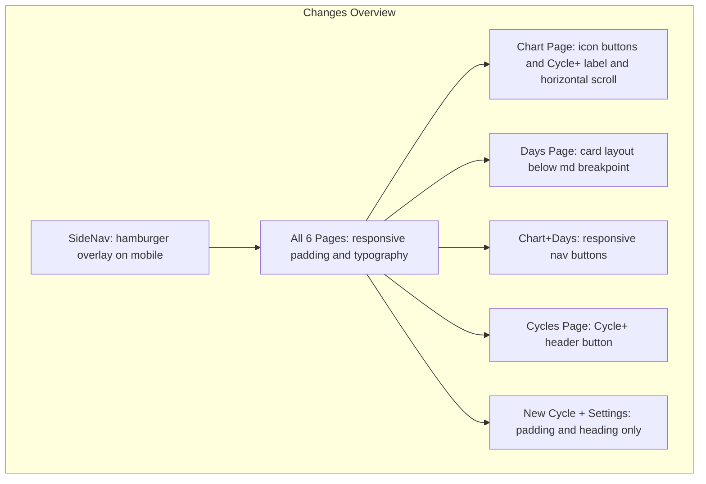

# Mobile Responsive Adaptation Plan

## Current Issues

All 6 cycle-tracking pages share the same layout: a **fixed 256px sidebar** (`w-64`) alongside content with `p-8` padding. None have responsive behavior, making them unusable on screens narrower than ~768px.**Pages to update:**| Page | File | Specific Issues ||---|---|---|| Chart | [CycleChartPage.tsx](app/src/cycle-tracking/CycleChartPage.tsx) | Chart requires ~800px+; header buttons crowd; "Begin new cycle" too long || Days | [CycleDaysPage.tsx](app/src/cycle-tracking/CycleDaysPage.tsx) | 7-column table doesn't fit on mobile || Add Day | [AddCycleDayPage.tsx](app/src/cycle-tracking/AddCycleDayPage.tsx) | Sidebar/padding issues; form layout already mostly responsive || My Cycles | [CyclesPage.tsx](app/src/cycle-tracking/CyclesPage.tsx) | Sidebar/padding; "Begin new cycle" button in header || New Cycle | [NewCyclePage.tsx](app/src/cycle-tracking/NewCyclePage.tsx) | Sidebar/padding; form grid already uses `grid-cols-1 md:grid-cols-2` || Settings | [SettingsPage.tsx](app/src/cycle-tracking/SettingsPage.tsx) | Sidebar/padding; simple layout otherwise || **Shared** | [SideNav.tsx](app/src/cycle-tracking/SideNav.tsx) | Always visible at 256px, consumes most of a mobile screen |

## Implementation Plan

### 1. Make SideNav collapsible on mobile

Convert the sidebar to a **hamburger-toggled overlay** on small screens:

- Add a hamburger button (visible only below `md:`) that opens the nav as a full-height overlay with a semi-transparent backdrop
- On `md:` and above, keep the current static sidebar as-is
- Add a close button inside the mobile overlay
- The nav will use `fixed inset-0 z-50` positioning when open on mobile
- No new dependencies needed -- just Tailwind responsive utilities and a `useState` for open/closed

### 2. Responsive padding and typography (all 6 pages)

On all pages that use the `
` + `
` pattern:

- Change `p-8` to `p-4 md:p-8` (including loading/error states)
- Change `text-3xl` headings to `text-xl md:text-3xl`
- Change `text-2xl` sub-headings to `text-lg md:text-2xl` (e.g. CyclesPage "Past Cycles")
- Change `mb-8` title margins to `mb-4 md:mb-8` where appropriate

Affected files (all in `app/src/cycle-tracking/`):

- [CycleChartPage.tsx](app/src/cycle-tracking/CycleChartPage.tsx)
- [CycleDaysPage.tsx](app/src/cycle-tracking/CycleDaysPage.tsx)
- [AddCycleDayPage.tsx](app/src/cycle-tracking/AddCycleDayPage.tsx)
- [CyclesPage.tsx](app/src/cycle-tracking/CyclesPage.tsx)
- [NewCyclePage.tsx](app/src/cycle-tracking/NewCyclePage.tsx)
- [SettingsPage.tsx](app/src/cycle-tracking/SettingsPage.tsx)

### 3. Chart page -- responsive buttons and horizontal scroll

**Header buttons ("View Days" / "Add a Day"):** Show as **icon-only on mobile**, full text on `sm:` and up.

- "View Days": add a list icon SVG, wrap text in ``
- "Add a Day": already has a plus-circle SVG; wrap text in ``, adjust icon margin to `sm:mr-1`
- Add `aria-label` on both buttons for accessibility

**"Begin new cycle" button:** Show as **"Cycle +"** on mobile, full text on `sm:` and up.

- `Cycle +Begin new cycle`

**Chart area:** The chart with its absolutely-positioned custom grid rows cannot shrink below ~800px.

- Wrap the chart container in a horizontally-scrollable `
` with a `min-w-[800px]` on the inner content so users can scroll sideways on mobile

### 4. Days page -- card-based mobile layout

The 7-column table is the main problem. Replace it with a responsive approach:

- **Below `md:`**: Show each cycle day as a compact **card** instead of a table row. Each card shows the key info (day number, date, BBT, intercourse indicator) with an Edit/Delete action row
- **At `md:` and above**: Keep the existing table layout unchanged

This avoids horizontal scrolling for the days table and makes Edit/Delete actions easily tappable.

### 5. Cycle navigation buttons -- responsive text

The "Previous Cycle (#N)" / "Next Cycle (#N)" buttons on both chart and days pages:

- Use shorter labels on mobile: e.g., `< #3` / `#5 >` on small screens, full text on `sm:` and up

### 6. CyclesPage -- responsive header

- Same padding/heading treatment as section 2
- **"Begin new cycle" button** in the page header (line 88): apply the same `Cycle +` / `Begin new cycle` responsive text pattern as the chart page
- CSV import section already uses `flex-col sm:flex-row` -- no changes needed
- Cycle action button groups already use `flex flex-wrap gap-2` -- no changes needed

### 7. NewCyclePage and SettingsPage -- responsive padding only

- Apply padding (`p-4 md:p-8`) and heading (`text-xl md:text-3xl`) fixes
- **NewCyclePage**: form grid already uses `grid-cols-1 md:grid-cols-2`, submit row uses `flex gap-3` -- no further changes needed
- **SettingsPage**: simple radio buttons and save button -- no further changes needed

